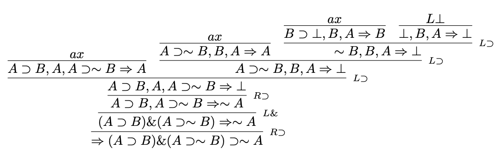

# PESCA = Proof Editor for Sequent Calculus

(c) Aarne Ranta 1999-2024

Ported to GitHub from the Hackage page of Gwern Branwen in 2008.



PESCA is a companion to the book Structural Proof Theory by Sara Negri and Jan von Plato,
Cambridge University Press, 2001.

[Book web page](https://www.cambridge.org/core/books/structural-proof-theory/487F9F5F1E6174867B458B819043C36B#:~:text=Book%20description,be%20of%20interest%20to%20specialists.)

To run under Unix, do
```
cd src
runghc Editor.hs
```
(also a compiled version can be built by using Cabal).

To do this, you need the
[Haskell Compiler GHC](https://www.haskell.org/ghc/).

Some commands need `pdflatex` and a way to open PDF files.
The latter is by default `open`, which works in MacOS.
This default can be changed by changing the value of `openPDF` in `Editor.hs`.


To the PESCA prompt |-, type
```
  ?
```

More information in the [PESCA manual](doc/manual.pdf) - and of course
in the *Structural Proof Theory* book.

